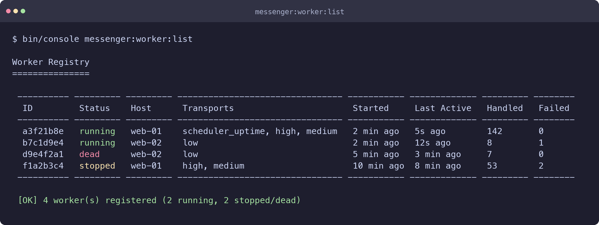
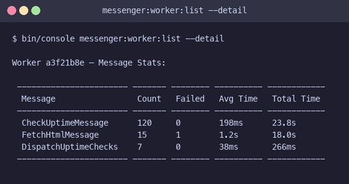
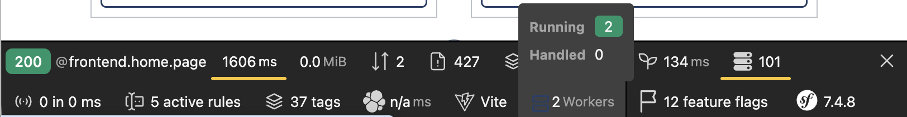
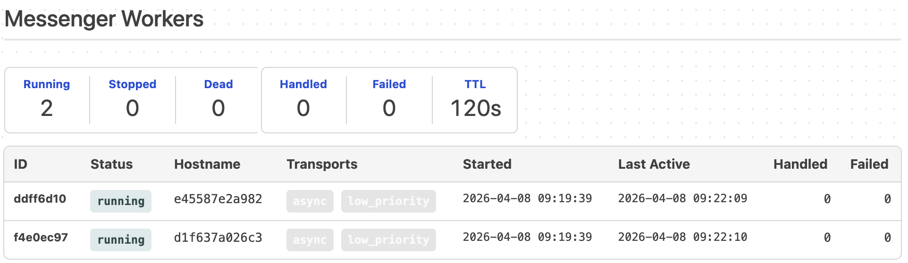

Messenger Worker Registry
=========================

The Messenger Worker Registry component provides real-time visibility into your
Symfony Messenger workers. Track running workers, their transports, message
throughput, failure rates, and per-message-type performance — all via a simple
console command.

Features
--------

- **Zero configuration** — install the bundle and it just works
- **Automatic registration** — workers register themselves on startup via event listeners
- **Worker status** — see at a glance which workers are `running`, `stopped`, or `dead`
- **Hostname tracking** — identify which host each worker is running on
- **Heartbeat with TTL** — crashed workers show as "dead" before expiring from the registry
- **Configurable TTL** — adjust the TTL to match your environment
- **Message counters** — track handled and failed messages per worker
- **Per-message-type stats** — see count, failure rate, and average processing time per message class
- **Console command** — `messenger:worker:list` with table and JSON output
- **Web Debug Toolbar** — see worker count and status at a glance in the Symfony profiler
- **Configurable cache pool** — use any PSR-6 cache pool instead of the default `cache.app`
- **No external dependencies** — uses Symfony's built-in PSR-6 cache (filesystem, Redis, APCu — whatever you have configured)

Requirements
------------

- PHP 8.2+
- Symfony 7.0+ or 8.0+

Installation
------------

```bash
composer require roman-1983/messenger-worker-registry
```

If you're not using Symfony Flex, register the bundle manually:

```php
// config/bundles.php
return [
    // ...
    ShopWatch\MessengerWorkerRegistry\MessengerWorkerRegistryBundle::class => ['all' => true],
];
```

That's it. No configuration needed — the defaults work out of the box.

Usage
-----

### List Running Workers

```bash
bin/console messenger:worker:list
```



### Worker Status

Each worker has one of three statuses:

| Status | Meaning |
|---|---|
| `running` | Worker is active, heartbeat received within TTL |
| `stopped` | Worker shut down gracefully via `WorkerStoppedEvent` |
| `dead` | Worker crashed — no heartbeat received for longer than TTL |

Stopped workers remain visible for 1x TTL after shutdown. Dead workers remain
visible for 2x TTL after their last heartbeat, then expire from the cache
automatically.

### Detailed View with Per-Message Stats

```bash
bin/console messenger:worker:list --detail
```



### JSON Output

```bash
bin/console messenger:worker:list --format=json
bin/console messenger:worker:list --format=json --detail
```

Returns a JSON array for programmatic consumption:

```json
[
  {
    "id": "a3f21b8e",
    "status": "running",
    "hostname": "web-01",
    "transports": ["scheduler_uptime", "high", "medium"],
    "started_at": "2026-03-03T14:22:10+00:00",
    "last_active_at": "2026-03-03T14:24:55+00:00",
    "messages_handled": 142,
    "messages_failed": 0,
    "message_stats": {
      "CheckUptimeMessage": {
        "count": 120,
        "failed": 0,
        "avg_ms": 198.3,
        "total_ms": 23796.0
      }
    }
  }
]
```

The `message_stats` key is only included when using `--detail`.

Web Debug Toolbar
-----------------

When `symfony/web-profiler-bundle` is installed, the bundle automatically adds a
toolbar item showing the number of running workers. The toolbar icon turns **red**
when dead workers are detected, and **yellow** when no workers are running.



Click the toolbar item to open the full profiler panel with:

- Summary metrics (running / stopped / dead counts, handled / failed totals, TTL)
- Worker table with status, hostname, transports, relative timestamps, and
  message counters
- Per-message-type breakdown with count, failure rate, total and average
  processing time

No extra configuration is needed — the data collector is registered
automatically.



How It Works
------------

The bundle listens to Symfony Messenger's built-in worker events:

| Event | Action |
|---|---|
| `WorkerStartedEvent` | Registers the worker with a generated ID, hostname, and transport list |
| `WorkerRunningEvent` | Sends a heartbeat every 30s to extend the cache TTL |
| `WorkerStoppedEvent` | Marks the worker as "stopped" (stays visible for 1x TTL) |
| `WorkerMessageReceivedEvent` | Starts a timer for processing duration |
| `WorkerMessageHandledEvent` | Increments handled counter, records per-type stats |
| `WorkerMessageFailedEvent` | Increments failed counter, records per-type stats |

### TTL and Worker Lifecycle

Each worker entry is stored with a cache TTL of **2x the configured TTL**
(default: 240 seconds). The heartbeat (fired every 30 seconds) resets this TTL
on each cycle.

- **Running**: Heartbeat keeps the entry alive. Status is "running" as long as
  `lastActiveAt` is within 1x TTL.
- **Crashed**: If a worker crashes without triggering `WorkerStoppedEvent`, its
  `lastActiveAt` goes stale. After 1x TTL it shows as "dead". After 2x TTL the
  cache entry expires automatically.
- **Graceful stop**: `WorkerStoppedEvent` sets `stoppedAt` and saves the entry
  with 1x TTL. It shows as "stopped" until it expires.

### Storage

The bundle uses Symfony's `cache.app` pool by default. This means it works out
of the box with whatever cache adapter you have configured (filesystem, Redis,
Memcached, APCu). For multi-server setups, make sure your cache adapter is
shared (e.g., Redis).

> **Docker / multi-container note:** If your web server and workers run in
> separate containers with the default filesystem cache adapter, they each have
> an isolated filesystem. Workers will register themselves, but the web container
> won't see them. To fix this, either mount a **shared volume** on the cache
> directory (e.g., `/app/var/share`) across all containers, or switch to a shared
> cache adapter like Redis.

Configuration
-------------

The bundle works without any configuration. You can optionally customize the TTL
and cache pool:

```yaml
# config/packages/messenger_worker_registry.yaml
messenger_worker_registry:
    ttl: 120          # seconds (default: 120, minimum: 10)
    cache: cache.app  # cache pool service ID (default: cache.app)
```

To use a dedicated cache pool, define it and reference it in the bundle config:

```yaml
# config/packages/cache.yaml
framework:
    cache:
        pools:
            cache.worker_registry:
                adapter: cache.adapter.redis

# config/packages/messenger_worker_registry.yaml
messenger_worker_registry:
    cache: cache.worker_registry
```

Testing
-------

```bash
composer install
vendor/bin/phpunit
```

Resources
---------

 * [Contributing](CONTRIBUTING.md)
 * [Report issues](https://github.com/roman-1983/messenger-worker-registry/issues) and
   [send Pull Requests](https://github.com/roman-1983/messenger-worker-registry/pulls) please.

License
-------

MIT License. See [LICENSE](LICENSE) for details.
